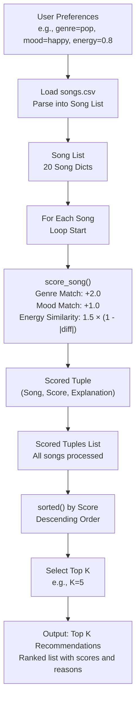
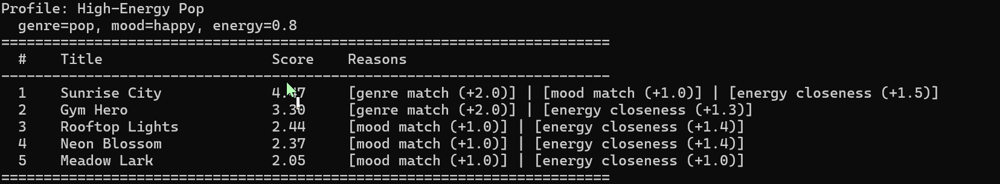
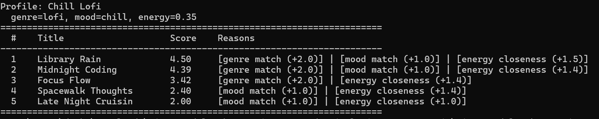
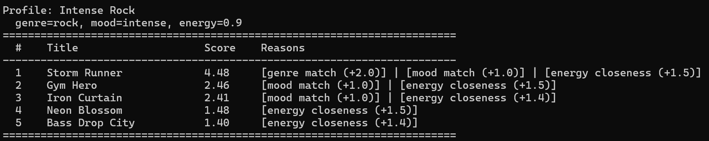
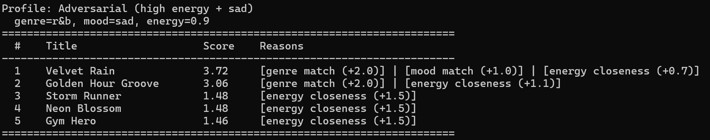
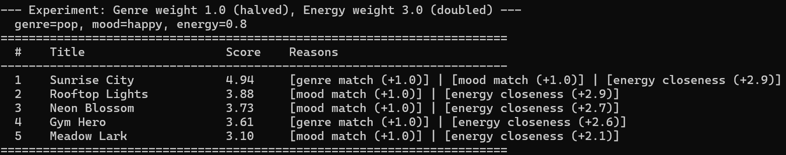

# 🎵 Music Recommender Simulation

## Project Summary

In this project you will build and explain a small music recommender system.

Your goal is to:

- Represent songs and a user "taste profile" as data
- Design a scoring rule that turns that data into recommendations
- Evaluate what your system gets right and wrong
- Reflect on how this mirrors real world AI recommenders

This project is a content-based music recommender that scores every song in a 20-song catalog against a user's preferred genre, mood, and energy level, then returns the top 5 ranked matches with plain-language explanations. It uses a weighted point system — genre match is worth the most, followed by mood, then energy closeness — so the results are transparent and easy to reason about. The goal is to simulate how a real streaming service might make personalized suggestions using only song metadata, without needing any data from other users.

---

## How The System Works

Real-world recommendation systems mix user signals, item attributes, and business goals. Services like Spotify and YouTube use both what other listeners liked and what each track sounds like, then prioritize relevance, diversity, and freshness for the listener. This version focuses on content-based matching: it compares a user profile to each song's metadata and audio-style features, then ranks songs by how well they match the user's preferred genre, mood, and energy.

### Features Used in Each Song
Each `Song` object uses the following attributes from the CSV data:
- `genre`: Categorical (e.g., "pop", "lofi") – primary matching criterion.
- `mood`: Categorical (e.g., "happy", "chill") – secondary matching criterion.
- `energy`: Numerical (0-1 scale) – for similarity scoring based on closeness to user's target energy.
- Additional attributes like `tempo_bpm`, `valence`, `danceability`, and `acousticness` are loaded but not used in scoring (potential for future expansion).

### UserProfile Information
The `UserProfile` stores:
- `favorite_genre`: String (e.g., "pop") – exact match for +2.0 points.
- `favorite_mood`: String (e.g., "happy") – exact match for +1.0 point.
- `target_energy`: Float (0-1) – used for energy similarity calculation.
- `likes_acoustic`: Boolean – optional bonus for acoustic songs (small weight in OOP version).

### Scoring Algorithm
Songs are scored using a point-based system for balance:
- **Genre Match**: +2.0 points if `song.genre == user.favorite_genre`.
- **Mood Match**: +1.0 point if `song.mood == user.favorite_mood`.
- **Energy Similarity**: 1.5 × (1 - |song.energy - user.target_energy|) points (continuous scale from 0 to 1.5, rewarding closeness).
- Total score range: 0-4.5. Higher scores indicate better matches.

### Recommendation Selection
- All songs are loaded from `songs.csv` and scored individually in a loop.
- Scored songs are sorted by total score (descending).
- Top K songs (default K=5) are selected and returned with scores and explanations (e.g., "genre match, mood match, energy closeness").
- This ensures ranked, explainable recommendations based on content similarity.

### Potential Biases
This system might over-prioritize genre matches (+2.0 points), potentially ignoring great songs that strongly match the user's mood or energy but differ in genre. It could also favor songs with moderate energy levels due to the linear similarity formula, overlooking highly energetic tracks for low-energy users. The small dataset limits diversity, and categorical matching assumes exact string matches, which may miss nuanced preferences.

### Data Flow



---

## Getting Started

### Setup

1. Create a virtual environment (optional but recommended):

   ```bash
   python -m venv .venv
   source .venv/bin/activate      # Mac or Linux
   .venv\Scripts\activate         # Windows

2. Install dependencies

```bash
pip install -r requirements.txt
```

3. Run the app:

```bash
python -m src.main
```

### Running Tests

Run the starter tests with:

```bash
pytest
```

You can add more tests in `tests/test_recommender.py`.

---

## Terminal Output

Below is the output from running `python -m src.main` with all test profiles:

---

**Profile 1: High-Energy Pop** — genre=pop, mood=happy, energy=0.8


> "Sunrise City" earns the top spot with a near-perfect score of 4.47 — it matches all three criteria (pop genre, happy mood, energy=0.82 vs target 0.8). "Gym Hero" ranks #2 despite having an "intense" mood, not "happy", because the +2.0 genre bonus for pop is strong enough to carry it over every non-pop song. This is the most important thing to notice: genre dominates. Songs ranked #3–#5 (Rooftop Lights, Neon Blossom, Meadow Lark) all match the happy mood but come from different genres — they can only compete on mood and energy, never on genre.

---

**Profile 2: Chill Lofi** — genre=lofi, mood=chill, energy=0.35


> This is the cleanest result of all four profiles. "Library Rain" (4.50) and "Midnight Coding" (4.39) both hit genre, mood, and energy — near-perfect matches. "Focus Flow" ranks #3 on genre alone even though its mood is "focused" not "chill", showing again that the genre bonus can carry a song past a missing mood point. Positions #4 and #5 (Spacewalk Thoughts, Late Night Cruisin) have no lofi genre but win on chill mood and close energy. The chill lofi profile works well because the catalog has exactly the songs this type of listener needs.

---

**Profile 3: Intense Rock** — genre=rock, mood=intense, energy=0.9


> "Storm Runner" is the only rock song in the catalog so #1 was never in doubt (4.48, all three criteria matched). The interesting result is #2 and #3: "Gym Hero" (pop/intense) and "Iron Curtain" (metal/intense) both have no genre overlap with rock at all, but their "intense" mood tag earns +1.0 each. A rock fan might accept metal at #3 — that feels musically reasonable — but seeing a pop workout song at #2 is jarring. It reveals that mood matching alone can produce genre-inappropriate suggestions when the catalog only has one song of the right genre.

---

**Profile 4: Adversarial** — genre=r&b, mood=sad, energy=0.9


> This profile was designed to expose a weakness, and it did. "Velvet Rain" ranks #1 with a score of 3.72 — it matches genre (r&b) and mood (sad) for +3.0 combined — but its actual energy is 0.38, nearly the opposite of the user's target of 0.9. The energy penalty brings it to only +0.72 out of a possible 1.5, yet it still wins comfortably. The user asked for something driving and intense; the system returned a slow ballad. This is not a bug — it is the scoring logic working exactly as designed — but it shows that when genre and mood labels win, the numeric energy signal can be completely overridden. Positions #3–#5 are all energy-only matches from unrelated genres, confirming the catalog simply has no high-energy sad r&b songs.

---

**Experiment: Genre weight 1.0 (halved), Energy weight 3.0 (doubled)** — pop/happy profile


> Halving the genre bonus and doubling the energy multiplier reshuffles the top 5 significantly. "Rooftop Lights" (indie pop/happy) jumps from #3 to #2, overtaking "Gym Hero" (pop/intense). With genre worth less, a song in a related genre that closely matches energy and mood can finally compete. "Gym Hero" drops to #4 — its high energy is still valued but its "intense" mood and weaker genre match now cost it more relatively. "Sunrise City" stays #1 because it wins on all three criteria regardless of weights. The key insight: the default scoring is intentionally genre-dominant. One number change is enough to shift the entire philosophy of what "good" means.

---

## Experiments You Tried

### Experiment: Halve Genre Weight, Double Energy Weight

Changed genre bonus from +2.0 to +1.0 and energy multiplier from 1.5× to 3.0× for the pop/happy profile.

**Result:** "Rooftop Lights" (indie pop) jumped from #3 to #2, overtaking "Gym Hero" (pop). The genre wall weakened enough that energy closeness and mood could compete. "Sunrise City" still ranked #1 because it matches all three criteria, but the score gap between #1 and #2 narrowed from 1.0 to 1.06 — much closer than before.

**Takeaway:** Genre dominates the default ranking. Reducing its weight creates more diverse, mood-and-energy-driven results.

---

## Limitations and Risks

- Only works on a 20-song catalog — too small for real diversity
- Does not understand lyrics, language, or cultural context
- Exact string matching for genre/mood misses related styles (e.g., "indie pop" ≠ "pop")
- No user history — every session starts from scratch with the same fixed profile
- The adversarial test showed that genre match can override the user's stated energy preference entirely

---

## Reflection

Read and complete `model_card.md`:

[**Model Card**](model_card.md)

Building this recommender made it clear that every weight in a scoring system is a design decision with real consequences. Doubling the energy weight shifted the top results noticeably — songs that "felt right" by genre suddenly lost ground to songs that felt right by energy. This is exactly what happens at scale on Spotify or YouTube: the engineers who set those weights are deciding what "relevant" means for millions of listeners, often without those listeners knowing it.

The adversarial profile (r&b + sad + high energy = 0.9) was the most revealing test. "Velvet Rain" ranked first even though its energy is 0.38 — nearly the opposite of what the user asked for — because genre and mood bonuses outweighed the energy penalty. In a real product, that would be a frustrating recommendation. It shows that bias in a recommender is not always about data — sometimes it is baked directly into the weights.
