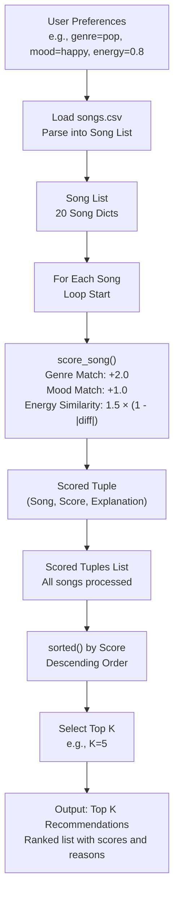

# 🎵 Music Recommender Simulation

## Project Summary

In this project you will build and explain a small music recommender system.

Your goal is to:

- Represent songs and a user "taste profile" as data
- Design a scoring rule that turns that data into recommendations
- Evaluate what your system gets right and wrong
- Reflect on how this mirrors real world AI recommenders

This project is a content-based music recommender that scores every song in a 20-song catalog against a user's preferred genre, mood, and energy level, then returns the top 5 ranked matches with plain-language explanations. It uses a weighted point system — genre match is worth the most, followed by mood, then energy closeness — so the results are transparent and easy to reason about. The goal is to simulate how a real streaming service might make personalized suggestions using only song metadata, without needing any data from other users.

---

## How The System Works

Real-world recommendation systems mix user signals, item attributes, and business goals. Services like Spotify and YouTube use both what other listeners liked and what each track sounds like, then prioritize relevance, diversity, and freshness for the listener. This version focuses on content-based matching: it compares a user profile to each song's metadata and audio-style features, then ranks songs by how well they match the user's preferred genre, mood, and energy.

### Features Used in Each Song
Each `Song` object uses the following attributes from the CSV data:
- `genre`: Categorical (e.g., "pop", "lofi") – primary matching criterion.
- `mood`: Categorical (e.g., "happy", "chill") – secondary matching criterion.
- `energy`: Numerical (0-1 scale) – for similarity scoring based on closeness to user's target energy.
- Additional attributes like `tempo_bpm`, `valence`, `danceability`, and `acousticness` are loaded but not used in scoring (potential for future expansion).

### UserProfile Information
The `UserProfile` stores:
- `favorite_genre`: String (e.g., "pop") – exact match for +2.0 points.
- `favorite_mood`: String (e.g., "happy") – exact match for +1.0 point.
- `target_energy`: Float (0-1) – used for energy similarity calculation.
- `likes_acoustic`: Boolean – optional bonus for acoustic songs (small weight in OOP version).

### Scoring Algorithm
Songs are scored using a point-based system for balance:
- **Genre Match**: +2.0 points if `song.genre == user.favorite_genre`.
- **Mood Match**: +1.0 point if `song.mood == user.favorite_mood`.
- **Energy Similarity**: 1.5 × (1 - |song.energy - user.target_energy|) points (continuous scale from 0 to 1.5, rewarding closeness).
- Total score range: 0-4.5. Higher scores indicate better matches.

### Recommendation Selection
- All songs are loaded from `songs.csv` and scored individually in a loop.
- Scored songs are sorted by total score (descending).
- Top K songs (default K=5) are selected and returned with scores and explanations (e.g., "genre match, mood match, energy closeness").
- This ensures ranked, explainable recommendations based on content similarity.

### Potential Biases
This system might over-prioritize genre matches (+2.0 points), potentially ignoring great songs that strongly match the user's mood or energy but differ in genre. It could also favor songs with moderate energy levels due to the linear similarity formula, overlooking highly energetic tracks for low-energy users. The small dataset limits diversity, and categorical matching assumes exact string matches, which may miss nuanced preferences.

### Data Flow



---

## Getting Started

### Setup

1. Create a virtual environment (optional but recommended):

   ```bash
   python -m venv .venv
   source .venv/bin/activate      # Mac or Linux
   .venv\Scripts\activate         # Windows

2. Install dependencies

```bash
pip install -r requirements.txt
```

3. Run the app:

```bash
python -m src.main
```

### Running Tests

Run the starter tests with:

```bash
pytest
```

You can add more tests in `tests/test_recommender.py`.

---

## Terminal Output

Below is the output from running `python -m src.main` with the default pop/happy user profile:

```
Loaded 20 songs from catalog.

User Profile: genre=pop, mood=happy, energy=0.8
========================================================================
  #    Title                    Score    Reasons
------------------------------------------------------------------------
  1    Sunrise City             4.47     [genre match (+2.0)] | [mood match (+1.0)] | [energy closeness (+1.5)]
  2    Gym Hero                 3.30     [genre match (+2.0)] | [energy closeness (+1.3)]
  3    Rooftop Lights           2.44     [mood match (+1.0)] | [energy closeness (+1.4)]
  4    Neon Blossom             2.37     [mood match (+1.0)] | [energy closeness (+1.4)]
  5    Meadow Lark              2.05     [mood match (+1.0)] | [energy closeness (+1.0)]
========================================================================
```

"Sunrise City" ranks first because it matches the user's preferred genre (pop), mood (happy), and has near-identical energy (0.82 vs 0.8). "Gym Hero" follows with a genre match and high energy. "Rooftop Lights" earns third via mood match and close energy despite being indie pop.

---

## Experiments You Tried

Use this section to document the experiments you ran. For example:

- What happened when you changed the weight on genre from 2.0 to 0.5
- What happened when you added tempo or valence to the score
- How did your system behave for different types of users

---

## Limitations and Risks

Summarize some limitations of your recommender.

Examples:

- It only works on a tiny catalog
- It does not understand lyrics or language
- It might over favor one genre or mood

You will go deeper on this in your model card.

---

## Reflection

Read and complete `model_card.md`:

[**Model Card**](model_card.md)

Write 1 to 2 paragraphs here about what you learned:

- about how recommenders turn data into predictions
- about where bias or unfairness could show up in systems like this
